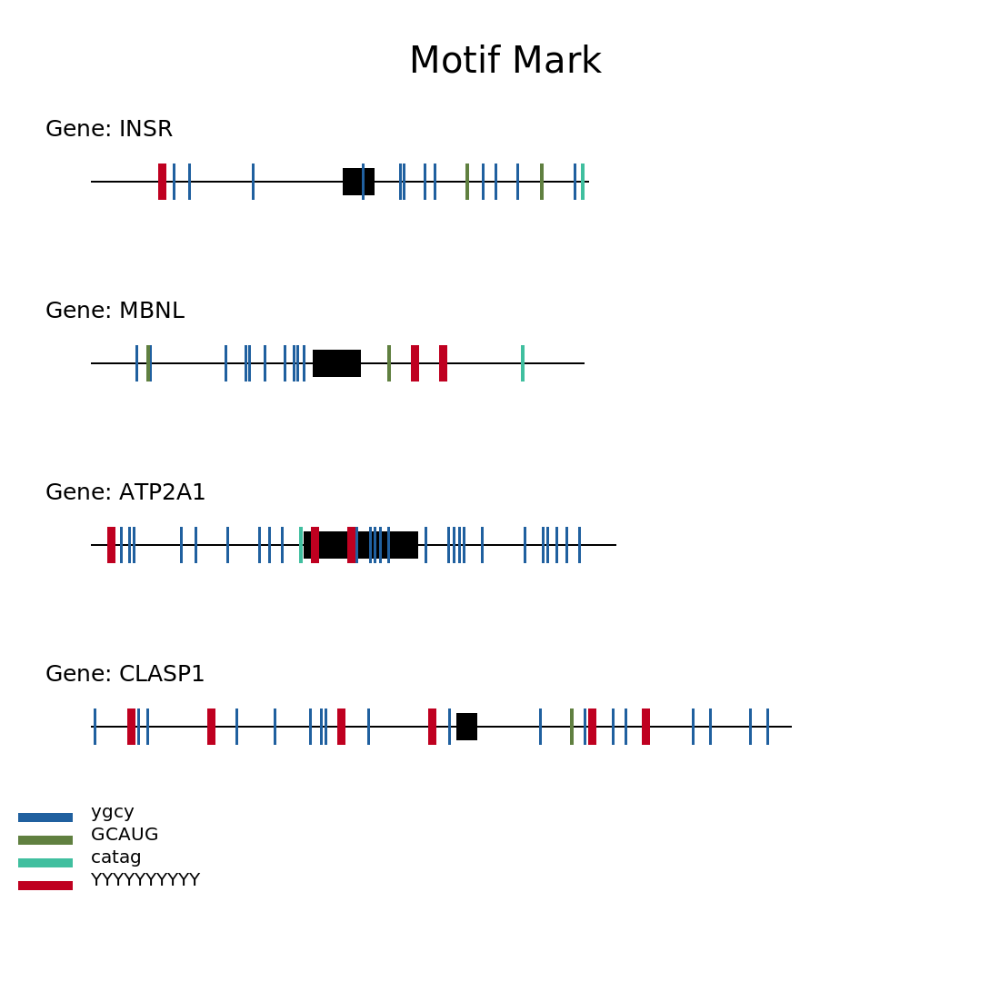

# Motif Mark

Project for Bi625, BGMP, Winter 2025. Generates visualization of protein binding motifs found in FASTA records.

### Input:

  -FASTA file containing up to 10 sequences with fewer than 1000 nucleotides
  -Motif file containing any number of motifs with one motif per line

### Output:

  -Visualization of binding motifs on each FASTA record with same file name prefix as FASTA file (i.e "Figure_1.fasta" -> "Figure_1.png")

## Usage:

### Dependencies:
  - PyCairo

### Run command:

'''motif-mark-oop.py [-h] -f FASTA -m MOTIF'''

